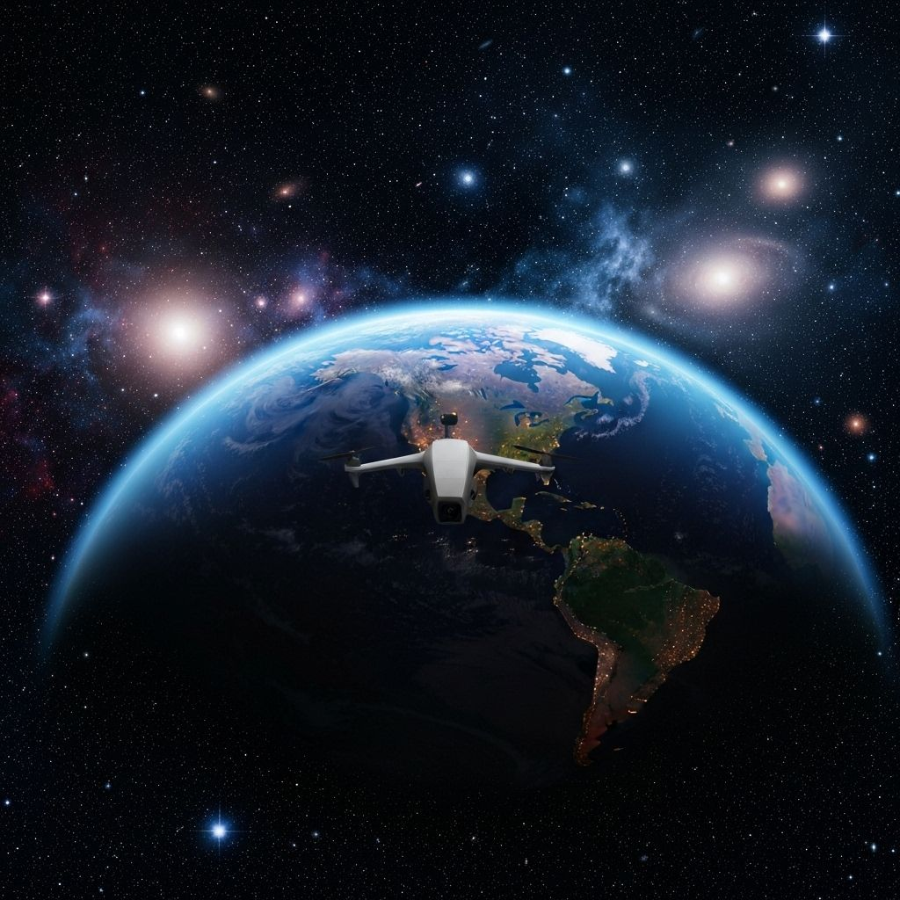

# 🚀 The Aetherian Voyage

### *Explore the Cosmos in Unprecedented Detail*

**[Live Demo](https://test.ltd)** • **[Documentation](#features)** • **[Report Bug](https://github.com/TheAz928/AetherianVoyage/issues)** • **[Request Feature](https://github.com/TheAz928/AetherianVoyage/issues)**

---

## 🌌 Overview

**The Aetherian Voyage** is a cutting-edge web application that brings NASA's vast collection of space imagery to your fingertips. Journey through multiple galaxies, explore our Solar System, and dive into gigapixel images of Earth, Moon, Mars, and distant cosmic phenomena with unprecedented detail and interactivity.

Built with modern web technologies and powered by validated NASA datasets, this platform democratizes access to space exploration data for students, researchers, educators, and space enthusiasts worldwide.

### ✨ Why Aetherian Voyage?

- 🔬 **Scientific Accuracy**: Built on validated, publicly accessible NASA datasets
- 🎓 **Educational Impact**: Empowering 50,000+ students across 120+ countries
- 🌍 **Open Science**: Barrier-free access promoting transparency and collaboration
- 🚀 **Cutting-Edge Tech**: Leveraging the latest web technologies for optimal performance
- 🎨 **Immersive Experience**: Space-themed UI with stunning animations and effects

---

## 🎯 Features

### 🔭 Gigapixel Image Viewer
- **Deep Zoom Interface**: Explore massive NASA images with smooth pan and zoom controls
- **DZI Technology**: Efficient tile-based loading for seamless navigation
- **Mini-Map Navigation**: Bird's-eye view for quick orientation
- **Coordinate Search**: Jump to specific locations instantly
- **HUD Overlay**: Real-time information display with mission data

### 🌠 Multi-Galaxy Navigation
- **Milky Way Galaxy**: Our home galaxy with the Solar System and Alpha Centauri
- **Andromeda Galaxy**: Explore our neighboring galaxy in stunning detail
- **Deep Space**: Journey to distant galaxies and cosmic phenomena
- **Hierarchical Structure**: Navigate through galaxies → solar systems → planets → images

### 🔄 Advanced Comparison Tools
- **Split-Screen Mode**: Compare two images side-by-side with synchronized zoom
- **Overlay View**: Blend images with adjustable opacity
- **Timeline Scrubber**: Track changes over time
- **Annotation Layer**: Mark and label features of interest

### 🎨 Immersive Space Experience
- **Dynamic Starfield**: Procedurally generated stars with twinkling effects
- **Shooting Stars**: Realistic meteor animations
- **Energy Particles**: Cosmic particle effects
- **Lens Flares**: Cinematic light effects
- **Galaxy Vortex**: Animated wormhole transitions
- **Space Explosions**: Dramatic visual effects
- **Background Audio**: Ambient space soundscapes
- **Interactive Sounds**: Click and hover sound effects

### 📊 Planetary Statistics
- Habitability scores
- Physical characteristics (radius, mass, gravity)
- Orbital and rotational data
- Atmospheric composition
- Surface conditions
- Mission information

---

## 🛠️ Tech Stack

### Core Framework
- **[Next.js 14](https://nextjs.org/)** - React framework with App Router
- **[React 19](https://react.dev/)** - UI library with latest features
- **[TypeScript](https://www.typescriptlang.org/)** - Type-safe development

### Styling & Animation
- **[Tailwind CSS v4](https://tailwindcss.com/)** - Utility-first CSS framework
- **[Framer Motion](https://www.framer.com/motion/)** - Production-ready animation library
- **[tw-animate-css](https://www.npmjs.com/package/tw-animate-css)** - Extended Tailwind animations

### UI Components
- **[Radix UI](https://www.radix-ui.com/)** - Accessible component primitives
- **[shadcn/ui](https://ui.shadcn.com/)** - Re-usable component collection
- **[Lucide React](https://lucide.dev/)** - Beautiful icon library

### Fonts
- **[Geist](https://vercel.com/font)** - Modern sans-serif and monospace fonts
- **[Orbitron](https://fonts.google.com/specimen/Orbitron)** - Futuristic display font

### Additional Libraries
- **[OpenSeadragon](https://openseadragon.github.io/)** - Deep zoom image viewer (implied)
- **[React Hook Form](https://react-hook-form.com/)** - Form validation
- **[Zod](https://zod.dev/)** - Schema validation
- **[date-fns](https://date-fns.org/)** - Date utility library
- **[Recharts](https://recharts.org/)** - Charting library

---

## 🚀 Getting Started

### Prerequisites

- **Node.js** 18.x or higher
- **pnpm** (recommended), npm, or yarn

### Installation

1. **Clone the repository**
   \`\`\`bash
   git clone https://github.com/TheAz928/AetherianVoyage.git
   cd aetherian-voyage
   \`\`\`

2. **Install dependencies**
   \`\`\`bash
   pnpm install
   # or
   npm install
   # or
   yarn install
   \`\`\`

3. **Run the development server**
   \`\`\`bash
   pnpm dev
   # or
   npm run dev
   # or
   yarn dev
   \`\`\`

4. **Open your browser**

   Navigate to [http://localhost:3000](http://localhost:3000) to see the application.

### Project Structure

\`\`\`
aetherian-voyage/
├── app/                      # Next.js App Router pages
│   ├── about/               # About page
│   ├── compare/             # Image comparison page
│   ├── team/                # Team page
│   ├── universe/            # Galaxy/system navigation
│   ├── viewer/              # Image viewer page
│   ├── layout.tsx           # Root layout
│   ├── page.tsx             # Home page
│   └── globals.css          # Global styles
├── components/              # React components
│   ├── ui/                  # shadcn/ui components
│   ├── annotation-layer.tsx
│   ├── background-audio.tsx
│   ├── compare-viewer.tsx
│   ├── dzi-viewer.tsx
│   ├── energy-particles.tsx
│   ├── galaxy-vortex.tsx
│   ├── hud-overlay.tsx
│   ├── lens-flare.tsx
│   ├── mini-map.tsx
│   ├── navbar.tsx
│   ├── shooting-stars.tsx
│   ├── space-scene.tsx
│   ├── starfield.tsx
│   └── toolbar.tsx
├── hooks/                   # Custom React hooks
│   ├── use-mobile.ts
│   ├── use-space-audio.tsx
│   └── use-toast.ts
├── lib/                     # Utility functions
│   ├── universe-data.ts    # Galaxy/planet data structure
│   └── utils.ts            # Helper functions
├── public/                  # Static assets
│   ├── dzi/                # DZI image tiles (add your own)
│   └── *.jpg               # Image assets
└── package.json            # Dependencies
\`\`\`

---

## 📦 Building for Production

### Build the application

\`\`\`bash
pnpm build
# or
npm run build
# or
yarn build
\`\`\`

### Start the production server

\`\`\`bash
pnpm start
# or
npm start
# or
yarn start
\`\`\`

### Run linting

\`\`\`bash
pnpm lint
# or
npm run lint
# or
yarn lint
\`\`\`

---

## 🌐 Deployment

### Deploy to Vercel (Recommended)

The easiest way to deploy The Aetherian Voyage is using [Vercel](https://vercel.com), the platform built by the creators of Next.js.

#### Option 1: Deploy with Vercel CLI

1. **Install Vercel CLI**
   \`\`\`bash
   pnpm add -g vercel
   \`\`\`

2. **Deploy**
   \`\`\`bash
   vercel
   \`\`\`

3. **Follow the prompts** to link your project and deploy

#### Option 2: Deploy via GitHub

1. **Push your code to GitHub**
   \`\`\`bash
   git add .
   git commit -m "Initial commit"
   git push origin main
   \`\`\`

2. **Import to Vercel**
    - Go to [vercel.com/new](https://vercel.com/new)
    - Import your GitHub repository
    - Vercel will auto-detect Next.js and configure settings
    - Click "Deploy"

3. **Configure Environment Variables** (if needed)
    - Add any required environment variables in Vercel dashboard
    - Redeploy if necessary

#### Option 3: One-Click Deploy

### Deploy to Other Platforms

#### Netlify
\`\`\`bash
# Install Netlify CLI
npm install -g netlify-cli

# Build and deploy
netlify deploy --prod
\`\`\`

#### Docker
\`\`\`dockerfile
# Create a Dockerfile
FROM node:18-alpine AS base

# Install dependencies
FROM base AS deps
WORKDIR /app
COPY package.json pnpm-lock.yaml ./
RUN npm install -g pnpm && pnpm install --frozen-lockfile

# Build application
FROM base AS builder
WORKDIR /app
COPY --from=deps /app/node_modules ./node_modules
COPY . .
RUN npm install -g pnpm && pnpm build

# Production image
FROM base AS runner
WORKDIR /app
ENV NODE_ENV production
COPY --from=builder /app/public ./public
COPY --from=builder /app/.next/standalone ./
COPY --from=builder /app/.next/static ./.next/static

EXPOSE 3000
CMD ["node", "server.js"]
\`\`\`

\`\`\`bash
# Build and run
docker build -t aetherian-voyage .
docker run -p 3000:3000 aetherian-voyage
\`\`\`

---

## 📊 Data Sources

This project is built on validated, publicly accessible NASA datasets:

| Source | Description | Link |
|--------|-------------|------|
| **NASA Exoplanet Archive** | Comprehensive exoplanet data and documentation | [Visit](https://exoplanetarchive.ipac.caltech.edu/docs/data.html) |
| **USGS Astrogeology** | Planetary mapping resources and exoplanet data | [Visit](https://astrogeology.usgs.gov/search) |
| **Mars 2020 Aeolis Mosaic** | Terrain-relative navigation CTX DTM mosaic | [Visit](https://astrogeology.usgs.gov/search/map/mars_2020_terrain_relative_navigation_ctx_dtm_mosaic) |
| **Direct Imaging Data** | Exoplanet direct imaging observations | [Visit](https://exoplanetarchive.ipac.caltech.edu/cgi-bin/TblView/nph-tblView?app=ExoTbls&config=directimaging) |
| **Apollo Lunar Data** | High-resolution Moon surface imagery | [Visit](https://nssdc.gsfc.nasa.gov/planetary/lunar/apollo_psr.html) |
| **NASA Earthdata** | Earth observation data from multiple missions | [Visit](https://earthdata.nasa.gov/) |
| **Mars Orbiter Mission** | Planetary Data System imaging archives | [Visit](https://pds-imaging.jpl.nasa.gov/portal/mars_orbiter_mission.html) |
| **NASA Open APIs** | Access to NASA's public data and imagery | [Visit](https://api.nasa.gov/) |

---

## 👥 Credits

### Development Team

**Team CosmonovaBD** - *Core Development & Design*

### Special Thanks

- **NASA** - For providing open access to incredible space imagery and data
- **USGS Astrogeology Science Center** - For planetary mapping resources
- **Vercel** - For the amazing Next.js framework and hosting platform
- **The Open Source Community** - For the incredible tools and libraries

### Image Credits

All planetary and space imagery used in this project is sourced from:
- NASA (National Aeronautics and Space Administration)
- ESO (European Southern Observatory)
- Various NASA missions including:
    - Suomi NPP
    - Lunar Reconnaissance Orbiter (LRO)
    - Mars Reconnaissance Orbiter (MRO)
    - Hubble Space Telescope
    - And many more

### Fonts

- **Geist Sans & Mono** by [Vercel](https://vercel.com/font)
- **Orbitron** by [Matt McInerney](https://fonts.google.com/specimen/Orbitron)

### UI Components

- **shadcn/ui** by [shadcn](https://ui.shadcn.com/)
- **Radix UI** by [Radix](https://www.radix-ui.com/)

---

### Reporting Issues

Found a bug or have a feature request? Please [open an issue](https://github.com/yourusername/aetherian-voyage/issues) with:
- Clear description of the problem/feature
- Steps to reproduce (for bugs)
- Expected vs actual behavior
- Screenshots (if applicable)

---

## 📄 License

This project is licensed under the **MIT License** - see the [LICENSE](LICENSE) file for details.

### MIT License Summary

- ✅ Commercial use
- ✅ Modification
- ✅ Distribution
- ✅ Private use
- ❌ Liability
- ❌ Warranty

---

## 🌟 Acknowledgments

This project is part of our commitment to:
- **Democratizing space exploration data** for global audiences
- **Supporting STEM education** through accessible technology
- **Promoting open science** and collaborative research
- **Inspiring the next generation** of space explorers

### Support the Project

If you find this project helpful, please consider:
- ⭐ Starring the repository
- 🐛 Reporting bugs
- 💡 Suggesting new features
- 📢 Sharing with others

---

### 🚀 Ready to Explore the Cosmos?

**[Launch Application](https://test.ltd)** • **[View Documentation](#features)**

---

Made with 💙 by **Team CosmonovaBD**

*Powered by NASA Open Data*

